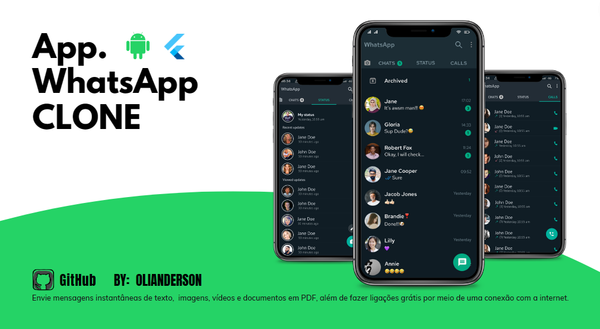

## 💻 Projeto WhatsAppCLONE Android com Flutter marc/2023 


<h1 align="center">
  
</h1>


O projeto consiste em desenvolver uma aplicação mobile, utilizando as tecnologias Dart, Flutter e Firebase. É uma aplicação acadêmica e open source onde será recriado alguns dos recursos do WhatsApp.

## **🔖 Status**

EM CONSTRUÇÃO

## **✨ Características**

- [x] Utilizar a linguagem Dart;
- [x] Bons padrões de desenvolvimento e código limpo;
- [x] Organização dos arquivos dentro do projeto;


## **🛠️ Ferramentas/Tecnologia**

A aplicação foi desenvolvida usando as tecnologias:

- Flutter 3.7.7
- Firebase para autenticação
- Git and GitHub 

<a href="https://dart.dev/"> 
<a href="https://flutter.dev/"> 
<a href="https://git-scm.com/about"> 

## 🔧 **Running**

```js
git clone
run backend with vscode
```


